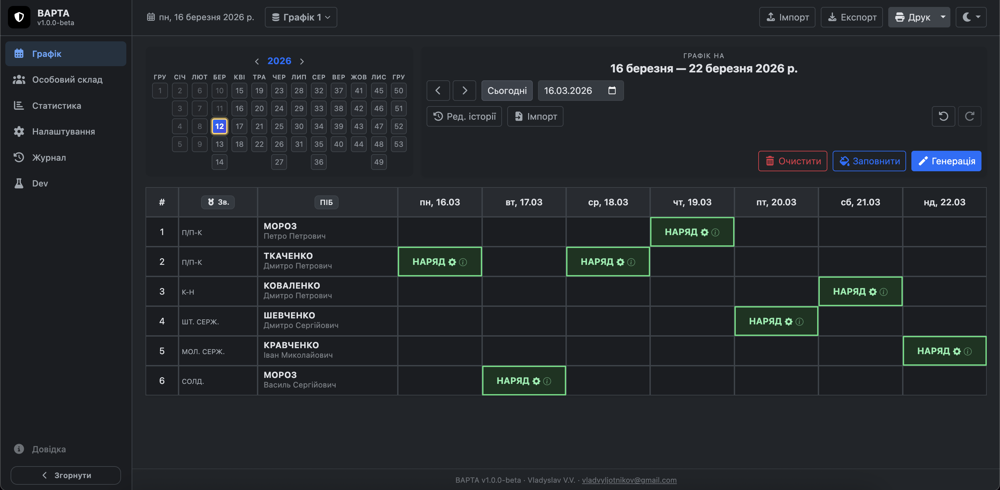

<p align="center">
  
</p>

# VARTA — Automatic Duty Scheduling Planner

> **PWA / Tauri desktop application** for fair and automatic duty scheduling in a military unit.  
> Built with React 19 + TypeScript + Vite. Data stored locally in IndexedDB (Dexie.js). No server.


> _Screenshot placeholder — add a screenshot or GIF of the main schedule view here._

---

## Contents

1. [About the application](#1-about-the-application)
2. [Tech stack and architecture](#2-tech-stack-and-architecture)
3. [Data storage](#3-data-storage)
4. [User structure](#4-user-structure)
5. [Schedule entry](#5-schedule-entry)
6. [Interface tabs](#6-interface-tabs)
7. [Auto-scheduler logic](#7-auto-scheduler-logic)
8. [Hard constraints](#8-hard-constraints)
9. [Candidate filters](#9-candidate-filters)
10. [10-priority comparator](#10-10-priority-comparator)
11. [Global objective function Z](#11-global-objective-function-z)
12. [Three-phase swap optimization](#12-three-phase-swap-optimization)
13. [Vacations, trips, and statuses](#13-vacations-trips-and-statuses)
14. [Karma system (debt / owedDays)](#14-karma-system-debt--oweddays)
15. [Load Rate and Anti-Catch-Up](#15-load-rate-and-anti-catch-up)
16. [Weekday weights](#16-weekday-weights)
17. [Logic settings (AutoScheduleOptions)](#17-logic-settings-autoscheduleoptions)
18. [Cascade recalculation](#18-cascade-recalculation)
19. [DecisionLog - the "i" button](#19-decisionlog---the-i-button)
20. [Multi-database (units)](#20-multi-database-units)
21. [Export / Import](#21-export--import)
22. [Run and build](#22-run-and-build)

---

## 1. About the application

**VARTA** is a tool for automatic and semi-automatic duty schedule generation. Its main goal is a
**fair distribution of workload** that takes into account:

- user statuses (vacation, trip, sick leave, absence);
- weekday weight coefficients (weekends are heavier than weekdays);
- karma / debt - who missed or lost duties in the past;
- incompatible pairs (do not place certain users on adjacent days);
- blocked weekdays for a specific user;
- multiple databases (units).

The application supports two deployment modes: **PWA** (browser) and **Tauri** (native desktop).

---

## 2. Tech stack and architecture

```text
React 19 + TypeScript + Vite
├── PWA (manifest + service worker)
├── Tauri 2 (native desktop wrapper)
├── IndexedDB / Dexie.js v9 - local storage
├── SCSS - styles with dark theme support
└── Vitest - tests
```

```text
src/
├── components/       - UI components (table, modals, navigation)
│   ├── schedule/     - main schedule screen components
│   └── users/        - personnel components
├── hooks/            - business logic (React hooks)
├── services/
│   ├── autoScheduler/
│   │   ├── scheduler.ts       - greedy pass + optimization entry point
│   │   ├── comparator.ts      - 10-priority comparator + filters
│   │   ├── helpers.ts         - Load Rate, active days, SSE, objective Z
│   │   ├── swapOptimizer.ts   - three-phase swap optimization
│   │   ├── decisionLog.ts     - "i" button decision text builder
│   │   └── index.ts           - public scheduler API
│   ├── scheduleService.ts  - IndexedDB schedule CRUD
│   ├── userService.ts      - user CRUD + availability checks
│   └── auditService.ts     - action log
├── types/index.ts    - all TypeScript types
└── utils/            - dates, constants, fairness metrics
```

This project was developed with AI-assisted development tools, including Claude, GPT-4, and Gemini.

---

## 3. Data storage

Each unit is stored in a **separate IndexedDB database** via Dexie.js. Unit metadata is stored in
`localStorage`.

| Table      | Contents                                      |
| ---------- | --------------------------------------------- |
| `users`    | Personnel roster                              |
| `schedule` | Duty schedule entries                         |
| `auditLog` | Full action log (changes, generation, manual) |
| `appState` | Application settings (key-value storage)      |

---

## 4. User structure

```typescript
interface User {
  id: number;
  name: string;
  rank: string;

  // Status and status dates
  status: 'ACTIVE' | 'VACATION' | 'TRIP' | 'SICK' | 'ABSENT' | 'OTHER';
  statusFrom?: string; // 'YYYY-MM-DD'
  statusTo?: string;

  isActive: boolean; // false = dismissed/inactive (shown in a separate tab)
  excludeFromAuto: boolean; // manual assignment only
  isExtra: boolean; // trainee/driver - manual only

  // Karma
  debt: number; // < 0 means the user "owes" duties to the system
  owedDays: Record<string, number>; // debt for a specific weekday

  // Blocks
  blockedDays: number[]; // ISO DOW: 1=Mon ... 7=Sun
  blockedDaysFrom?: string;
  blockedDaysTo?: string;

  // Rest around status periods
  restBeforeStatus: boolean; // unavailable on the day before a status starts
  restAfterStatus: boolean; // unavailable on the day after a status ends

  incompatibleWith: number[]; // IDs of users who cannot stand on adjacent days
  dateAddedToAuto?: string; // date when the user joined auto-scheduling

  // Array of status periods (vacations, trips, sick leave, etc.)
  statusPeriods?: UserStatusPeriod[];
}

interface UserStatusPeriod {
  status: 'VACATION' | 'TRIP' | 'SICK' | 'ABSENT';
  from?: string;
  to?: string;
  restBefore?: boolean; // rest day before this period
  restAfter?: boolean; // rest day after this period
  comment?: string;
}
```

---

## 5. Schedule entry

```typescript
interface ScheduleEntry {
  date: string; // 'YYYY-MM-DD'
  userId: number | number[]; // one or multiple assignees (dutiesPerDay > 1)
  type: 'auto' | 'manual' | 'replace' | 'swap' | 'history' | 'import';
  isLocked: boolean;
  decisionLog?: DecisionLog; // why this user was selected ("i" button)
}
```

**Entry types:**

| Type                 | Behavior                                                                |
| -------------------- | ----------------------------------------------------------------------- |
| `auto`               | Created by the auto-scheduler; may be overwritten during regeneration   |
| `manual`             | Manual assignment; protected from automatic overwrite                   |
| `replace`            | Manual replacement; protected from auto                                 |
| `swap`               | Swap operation; protected from auto                                     |
| `history` / `import` | Historical entry; may be excluded from logic via `ignoreHistoryInLogic` |

---

## 6. Interface tabs

### Schedule (ScheduleView)

Main screen. Includes:

- **WeekNavigator** - visual year map: week squares grouped by month. Green = has schedule, gray =
  past, blue = current, bold border = selected week.
- **ScheduleControls** - control panel:

| Button                   | Action                                          |
| ------------------------ | ----------------------------------------------- |
| `← / → / Today`          | Week navigation                                 |
| `Fill gaps`              | Auto-fill empty days                            |
| `Fix conflicts`          | Fix unavailable assignees or explicitly keep them as exceptions |
| `Generate week`          | Full regeneration of the current week           |
| `Clear week`             | Delete all assignments for the current week     |
| `Optimization (cascade)` | Recalculate forward starting from a change date |
| `↩ / ↪`                  | Undo / Redo (up to 25 steps, Ctrl+Z / Ctrl+Y)   |
| `Import`                 | Import legacy schedule text                     |

- **ScheduleTable** - main table: rows = users, columns = days of the week. When there are more than
  20 users, it switches to a **day-centric** mode (one column = list of users for that day).

- **AssignmentModal** - assignment modal with `Replace / Swap / Remove`, a list of free users with
  metrics (load, wait days, debts), and search filtering.

### Personnel (UsersView)

Personnel table (active + inactive), editing, deletion, and **UserStatsModal** for detailed stats.

### Statistics (StatsView)

All-user table: number of duties, weighted load, debt, last duty date, and availability status.

### Settings (SettingsView)

Three sub-tabs: **Logic** (weights, AutoScheduleOptions), **Interface** (scale, theme), and
**Print** (signatories, print modes).

### Audit Log (AuditLogView)

All actions with filtering by type. Log cleanup for entries older than 90 days.

### Dev (DevTools)

Developer tools tab (always visible). Contains: data generators, test scenarios (standard group,
vacations, blocked days, incompatible pairs, small group, debt/karma), schedule generator with
fairness statistics, quick user status editor, chaos mode, and database wipe.

---

## 7. Auto-scheduler logic

The scheduler is implemented as a **two-pass CSP algorithm** (Constraint Satisfaction Problem):

```text
Draft (Greedy pass) -> Swap Optimization (3 phases)
```

### 7.1. Draft - greedy pass

For each date, sequentially:

```text
All users
    │
    ▼ [Hard] isAutoParticipant: isActive ∧ ¬isExtra ∧ ¬excludeFromAuto
    │
    ▼ [Hard] isHardEligible: available on this date
    │
    ▼ [Soft -> Hard fallback] filterByRestDays: minimum rest distance
    │
    ▼ [Hard] filterByIncompatiblePairs: incompatible neighbors on adjacent dates
    │
    ▼ [Soft -> Hard fallback] filterByWeeklyCap: <= 1 duty/week (for >=7 users)
    │
    ▼ [Hard] filterForceUseAllWhenFew: for <=7 users, only users with 0 duties this week
    │
    ▼ [Hard] filterEvenWeeklyDistribution: for <=7 users, only users with minimum duties this week
    │
    ▼ [Starvation Fallback] If the pool is empty -> roll back to all hard-eligible users
    │
    ▼ Rank candidates (10-priority comparator)
    │
    ▼ Select the best candidate
```

> **Starvation Fallback principle:** if soft filters empty the pool, the system rolls back to any
> hard-eligible candidate. A slot is left empty (`critical`) only when there are no available users
> at all.

### General workflow

```text
User clicks "Fill gaps"
    ↓
useScheduleActions.runFillGaps()
    ↓
pushHistory() -> save snapshot for undo
    ↓
useAutoScheduler.fillGaps(dates)
    ↓
autoFillSchedule(dates, users, schedule, options, dayWeights)
    ├── for each date:
    │   ├── build candidate pool (isUserAvailable)
    │   ├── apply filterByRestDays / filterByWeeklyCap / filterByIncompatiblePairs
    │   └── sortBy(buildUserComparator) -> take the first candidate
    └── performSwapOptimization()
        ├── Phase 1: Pair-Exchange Swaps
        ├── Phase 2: Single-Replacement
        └── Phase 3: Same-DOW Resolution
    ↓
saveAutoSchedule(entries, dayWeights)
    ├── db.schedule.put(entry)
    └── repayOwedDay() for each assigned user
    ↓
logAction('AUTO_FILL', ...)
    ↓
refreshData() -> rerender
```

---

## 8. Hard constraints

Checked in `isHardUnavailable()`. A user is **guaranteed unavailable** if:

| Reason             | Code               | Description                                                 |
| ------------------ | ------------------ | ----------------------------------------------------------- |
| Inactive           | `hard_inactive`    | `user.isActive === false`                                   |
| Excluded from auto | `hard_excluded`    | `user.excludeFromAuto === true`                             |
| Busy status        | `hard_status_busy` | VACATION / SICK / TRIP / ABSENT on this date                |
| Blocked weekday    | `hard_day_blocked` | `blockedDays` contains this DOW within the configured range |
| Rest day           | `hard_rest_day`    | `restBefore` / `restAfter` around a status period           |

These constraints are **never violated** - neither during Draft nor during swap optimization.

---

## 9. Candidate filters

After hard constraints, the candidate pool goes through soft filters:

| Filter             | Function                       | Logic                                                       |
| ------------------ | ------------------------------ | ----------------------------------------------------------- |
| Rest Days          | `filterByRestDays`             | Excludes users who served within `minRestDays`              |
| Incompatible Pairs | `filterByIncompatiblePairs`    | Checks adjacent dates for incompatible pairs                |
| Weekly Cap         | `filterByWeeklyCap`            | For >=7 users: max 1 duty per week (debt users excepted)    |
| Force Use All      | `filterForceUseAllWhenFew`     | With a small pool, only users with 0 duties this week       |
| Even Distribution  | `filterEvenWeeklyDistribution` | With a small pool, only users with minimum duties this week |
| Same Weekday       | `filterBySameWeekdayLastWeek`  | Excludes users who served the same DOW in the previous week |

Filters are applied sequentially. If a filter empties the pool, the previous state is restored
(fail-safe behavior).

---

## 10. 10-priority comparator

The comparator (`buildUserComparator`) compares two candidates across 12 features in priority order:

| #   | Criterion              | Type               | Description                                                                         |
| --- | ---------------------- | ------------------ | ----------------------------------------------------------------------------------- |
| -2  | Cross-DOW Zero Guard   | Hard penalty       | If a user has more duties on this DOW than the group minimum — heavy penalty        |
| -1  | forceUseAllWhenFew     | Hard switch        | For <=7 users: users with 0 duties this week always come first                      |
| 0   | DOW Count              | Fairness account   | Fewer assignments on this DOW -> higher priority                                    |
| 1   | DOW SSE Objective      | SSE minimization   | Candidate that minimizes post-assignment SSE for this DOW                           |
| 2   | Same-DOW Penalty       | Soft (exponential) | 7d=100, 14d=25, 21d=6.25, >28d=0                                                    |
| 3   | Weekly Cap Tie-break   | Tie-break          | Fewer duties this week -> higher priority (when `limitOneDutyPerWeekWhenSevenPlus`) |
| 4   | DOW Recency            | Tie-break          | More days since the last assignment on this DOW -> higher                           |
| 5   | Remaining Availability | forceUse mode      | Fewer remaining available days -> higher urgency                                    |
| 6   | Load Rate              | Anti-catch-up      | `Rate = assignments / daysActive` — lower rate first                                |
| 7   | Effective Load         | Weighted balance   | `Load + debt` when `considerLoad` is enabled                                        |
| 8   | Wait Days              | Tie-break          | More days since the last duty -> higher                                             |
| 9   | Stable ID              | Determinism        | `a.id - b.id` for reproducibility                                                   |

---

## 11. Global objective function Z

$$
Z = W_{\text{sameDOW}} \cdot P + W_{\text{SSE}} \cdot \text{SSE}_{\text{system}} + W_{\text{within}} \cdot V_{\text{within}} + W_{\text{load}} \cdot R_{\text{load}} + W_{\text{zero}} \cdot G_{\text{zero}} + W_{\text{total}} \cdot \text{SSE}_{\text{total}}
$$

### Components

| Symbol       | Description                  | Formula                                                    |
| ------------ | ---------------------------- | ---------------------------------------------------------- |
| `P`          | Same-DOW consecutive penalty | Number of pairs with the same user, same DOW, 7 days apart |
| `SSE_system` | Inter-user DOW SSE           | For each DOW: Σ(count - mean)² across all users            |
| `V_within`   | Intra-user DOW variance      | For each user: Σ(dowCount - mean)² across 7 DOWs           |
| `R_load`     | Max - Min load               | Difference between the most and least loaded users         |
| `G_zero`     | Zero Guard                   | If min DOW = 0 and max DOW >= 2: `1000 × (max - min)`      |
| `SSE_total`  | Total assignment SSE         | Σ(totalDuties - meanDuties)² to prevent concentration      |

### Weights

| Weight          | Value | Rationale                                                                                     |
| --------------- | ----- | --------------------------------------------------------------------------------------------- |
| `W_SAME_DOW`    | 50.0  | Highest cost: avoid the same weekday back-to-back                                             |
| `W_TOTAL_SSE`   | 100.0 | Anti-concentration: prevents the optimizer loading one user on all duties                     |
| `W_WITHIN_USER` | 300.0 | Intra-user DOW balance — dominates `W_SYSTEM_SSE` so personal balance is always maintained    |
| `W_SYSTEM_SSE`  | 3.0   | Base cross-user weekday fairness                                                              |
| `W_LOAD_RANGE`  | 1.0   | Soft pressure toward balanced load                                                            |
| `W_ZERO_GUARD`  | 10.0  | Multiplier on the internal zero-guard penalty (5000+), effective minimum 50 000 per violation |

---

## 12. Three-phase swap optimization

After the greedy draft, the system runs iterative optimization (up to `MAX_SWAP_ITERATIONS = 1500`).

```text
┌─────────────────────────────────────────────────────┐
│ Draft (Greedy pass)                                 │
│ For each date: Filter -> Rank -> Select candidate   │
└────────────────────────┬────────────────────────────┘
                         │
                         ▼
┌─────────────────────────────────────────────────────┐
│ Phase 1: Pair-Exchange Swaps                        │
│ U₁(d₁) ↔ U₂(d₂) if Z↓ and hard constraints are OK   │
└────────────────────────┬────────────────────────────┘
                         │ improvement? -> loop
                         ▼
┌─────────────────────────────────────────────────────┐
│ Phase 2: Single-Replacement                         │
│ U_old(d) -> U_new(d) if Z↓ and forceUseAll stays OK │
└────────────────────────┬────────────────────────────┘
                         │ improvement? -> back to Phase 1
                         ▼
┌─────────────────────────────────────────────────────┐
│ Phase 3: Same-DOW Resolution                        │
│ Search for back-to-back same DOW assignments        │
│ and resolve them through objective-improving swaps  │
└────────────────────────┬────────────────────────────┘
                         │ improvement? -> back to Phase 1
                         ▼
                      Stable Z
```

### Swap acceptance rule

Each swap must satisfy:

- `isHardEligible(u, d')` - the user is available on the new date
- no `minRestDays` violation
- no incompatible pair violation

The swap is accepted **only** on strict improvement:
$Z_{\text{new}} < Z_{\text{old}} - \varepsilon$, where $\varepsilon = 10^{-9}$.

---

## 13. Vacations, trips, and statuses

### Status types

| Status     | Blocking behavior                 | Description                               |
| ---------- | --------------------------------- | ----------------------------------------- |
| `VACATION` | STATUS_BUSY `[from, to]`          | Full vacation block                       |
| `SICK`     | STATUS_BUSY `[from, to]`          | Full sick leave block                     |
| `ABSENT`   | STATUS_BUSY `[from, to]`          | Full absence block                        |
| `TRIP`     | STATUS_BUSY `[from, to]` + buffer | Trip plus optional rest days before/after |
| `OTHER`    | STATUS_BUSY (if dates are set)    | Other custom status                       |

### restBefore / restAfter

Each status period may define **buffer rest days**:

```text
         restBefore       Status period          restAfter
    ┌─────────┐  ┌──────────────────────────┐  ┌─────────┐
    │  1 day  │  │  period.from .. period.to │  │  1 day │
    └─────────┘  └──────────────────────────┘  └─────────┘
    UNAVAILABLE        STATUS_BUSY               UNAVAILABLE
```

- **`restBeforeStatus`** - the day before the period starts -> `PRE_STATUS_DAY`
- **`restAfterStatus`** - the day after the period ends -> `REST_DAY`
- Priority: per-period configuration > per-user configuration

These days are treated as **hard blocks** and are subtracted from `daysActive`, so users are not
penalized with catch-up load after returning.

### Compensation memory

When a user misses hard or rare days (for example Saturdays) because of TRIP, the system
**automatically** remembers that through:

1. **DOW Fairness Deficit** - personal weekday deficit increases the priority for that weekday later
2. **DOW SSE Objective** - assigning the user on the missed weekday reduces SSE and raises priority
3. **Exponential recency penalty** (`getSameDowPenalty`)

| Days since last assignment on this DOW | Penalty |
| -------------------------------------- | ------- |
| <= 7 days                              | 100     |
| <= 14 days                             | 25      |
| <= 21 days                             | 6.25    |
| > 21 days                              | 0       |

This **compensation memory** is an emergent property of the scoring system, not a separate feature.

---

## 14. Karma system (debt / owedDays)

**Karma** tracks user debt and restores fairness after irregular events.

### Fields

| Field                          | Description                                    |
| ------------------------------ | ---------------------------------------------- |
| `debt: number`                 | Overall debt: `< 0` means the user owes duties |
| `owedDays: Record<DOW, count>` | Debt for a specific weekday                    |

### How debt changes

| Event                                  | Change                                    |
| -------------------------------------- | ----------------------------------------- |
| Removed from duty (`reason='request'`) | `debt -= dayWeight`, `owedDays[dayIdx]++` |
| Removed from duty (`reason='work'`)    | Karma does not change                     |
| Auto-assigned on the owed weekday      | `owedDays[dayIdx]--`, `debt += weight`    |
| Moved to a heavier weekday             | `debt += (toWeight - fromWeight)`         |
| Manual debt reset                      | `debt = 0`                                |

> **Limit:** `debt` is capped from below by `-maxDebt`.

### How it affects the scheduler

- **Comparator priority:** debt users receive priority when `respectOwedDays = true`
- **Extended weekly cap:** with `allowDebtUsersExtraWeeklyAssignments = true`, debt users may serve
  more frequently (up to `debtUsersWeeklyLimit` duties per week)
- **Faster repayment:** `prioritizeFasterDebtRepayment = true` raises their priority further

---

## 15. Load Rate and Anti-Catch-Up

### Load Rate formula

$$
\text{LoadRate}(u) = \frac{\text{totalAssignments}(u)}{\text{daysActive}(u)}
$$

where `daysActive` is the number of days from `dateAddedToAuto` until today **minus** unavailable
days (VACATION, SICK, TRIP, ABSENT, DAY_BLOCKED, PRE_STATUS_DAY, REST_DAY).

### The catch-up problem and the solution

**Without Anti-Catch-Up:**

```text
The user returns after a 14-day vacation.
daysActive = 30 (calendar days)
totalAssignments = 2
LoadRate = 2/30 = 0.067 -> looks "underused"
→ The system overloads the user to "catch up"
```

**With Anti-Catch-Up:**

```text
daysActive = 30 - 14 (vacation) = 16 available days
totalAssignments = 2
LoadRate = 2/16 = 0.125 -> fairly compared against others
→ No artificial catch-up, load stays proportional to availability
```

After vacation, trip, or sick leave, a user **does not receive extra duties** just to "make up" for
lost time. They simply return to the normal rotation.

---

## 16. Weekday weights

Default weights:

```typescript
DayWeights = {
  0: 1.5, // Sun
  1: 1.0, // Mon
  2: 1.0, // Tue
  3: 1.0, // Wed
  4: 1.0, // Thu
  5: 1.5, // Fri
  6: 2.0, // Sat
};
```

Weights are used to calculate **weighted load**:
`weightedLoad = Σ(dayWeight[dow] × assigned_on_dow)`.

### When weights stop affecting relative balance

At the ideal **1-1-1-1-1-1-1** pattern (exactly one duty on each weekday per user), weights no
longer affect the relative balance:

```text
If every user has exactly 1 duty on each DOW:
  weightedLoad(A) = weightedLoad(B) = Σ(all weights) = const
  -> Difference = 0, regardless of the chosen weights
```

Weights matter only when the ideal balance is impossible (small pool, many duties, frequent
absence).

---

## 17. Logic settings (AutoScheduleOptions)

Central algorithm config used by `autoFillSchedule` and `buildUserComparator`:

| Parameter                              | What it does                                                     |
| -------------------------------------- | ---------------------------------------------------------------- |
| `avoidConsecutiveDays`                 | Avoid adjacent duties (`filterByRestDays`)                       |
| `minRestDays`                          | Minimum rest in days (1 = not back-to-back, 2 = every other day) |
| `respectOwedDays`                      | Prioritize users with `owedDays` for the current weekday         |
| `considerLoad`                         | Include load in sorting                                          |
| `aggressiveLoadBalancing`              | Force balancing when load gaps become too large                  |
| `aggressiveLoadBalancingThreshold`     | Gap threshold for aggressive balancing (0.2 = 20%)               |
| `limitOneDutyPerWeekWhenSevenPlus`     | 1 duty per week when 7+ users are available                      |
| `allowDebtUsersExtraWeeklyAssignments` | Debt users may serve more often                                  |
| `debtUsersWeeklyLimit`                 | Maximum weekly duties for debt users (1-4)                       |
| `prioritizeFasterDebtRepayment`        | Speed up debt repayment                                          |
| `forceUseAllWhenFew`                   | With <=7 users, rotate through everyone                          |
| `evenWeeklyDistribution`               | With <=7 users, nobody gets N+1 duties while another has N       |
| `ignoreHistoryInLogic`                 | Exclude `history` / `import` entries from load calculations      |
| `lookaheadDepth`                       | Simulate N days ahead per candidate (0 = off)                    |
| `lookaheadCandidates`                  | How many top candidates to simulate in lookahead                 |
| `useTabuSearch`                        | Enable Tabu Search meta-heuristic after swap phases              |
| `tabuMaxIterations`                    | Tabu Search iteration limit                                      |
| `tabuTenure`                           | How many iterations a reverse move stays forbidden               |
| `useMultiRestart`                      | Enable Multi-Restart (Iterated Local Search) after Tabu          |
| `multiRestartTimeoutMs`                | Time budget for Multi-Restart in fixed mode (ms)                 |
| `multiRestartStrategy`                 | Perturbation strategy: `'pair-swap'` or `'lns'`                  |
| `multiRestartTimeLimitMode`            | `'fixed'` (timed) or `'unlimited'` (until user presses Stop)     |

---

## 18. Cascade recalculation

When a user or schedule change happens, the system stores `cascadeStartDate`. The control panel then
shows an **Optimization** button.

When pressed:

1. Take all AUTO entries starting from `cascadeStartDate`
2. Remove them from the database
3. Run `autoFillSchedule` again for those dates
4. Save the new result

Manual entries (`manual` / `replace` / `swap`) are **not affected**.

---

## 19. DecisionLog - the "i" button

Each auto-generated `ScheduleEntry` contains a `decisionLog` field that explains **why this user**
was assigned to this date.

```typescript
interface DecisionLog {
  userText: string; // Human-readable explanation
  debug: {
    winningCriterion: string; // "dowCount" | "loadRate" | ...
    assignedUserId: number;
    dowCount: number;
    dowSSE: number;
    sameDowPenalty: number;
    loadRate: number;
    waitDays: number;
    weeklyCount: number;
    poolSizes: { initial, afterHardEligible, afterRestDays, ... };
    alternatives: CandidateSnapshot[];
  };
}
```

Example `userText`:

```text
Assigned on Wednesday because:
• 1 Wednesday duty (group average: 1.4)
• Last duty was 5 days ago
```

---

## 20. Multi-database (units)

- Each unit is stored in a **separate IndexedDB database** with its own users, schedule, and
  settings
- Unit metadata is stored in `localStorage`
- **WorkspaceSelector** allows switching between units
- Backup formats: `v7` for a single database, `v8` for all databases plus workspace metadata

---

## 21. Export / Import

Backups are stored as JSON files. Versions `v6`, `v7`, and `v8` are supported.

| Version | Contents                                       |
| ------- | ---------------------------------------------- |
| `v7`    | One database (one unit)                        |
| `v8`    | All databases (all units) + workspace metadata |

**Backup indicator:** the export button pulses red when there are unsaved changes. A backup alert
appears if more than 3 days have passed since the last export.

**Legacy schedule import** is available through the `Import` button and is parsed by
`importScheduleService.ts`.

---

## 22. Run and build

### Development

```bash
npm install
npm run dev
```

### Tests

```bash
npm run test
npx vitest run
npx tsc --noEmit
```

### Build

```bash
npm run build
./build.sh
```

### Tauri (native desktop)

```bash
npm run tauri dev
npm run tauri build
```

---

## License

See [LICENSE](LICENSE).
